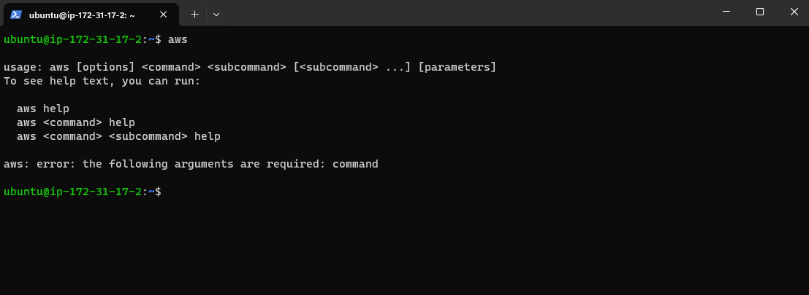
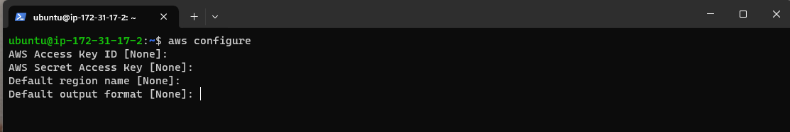
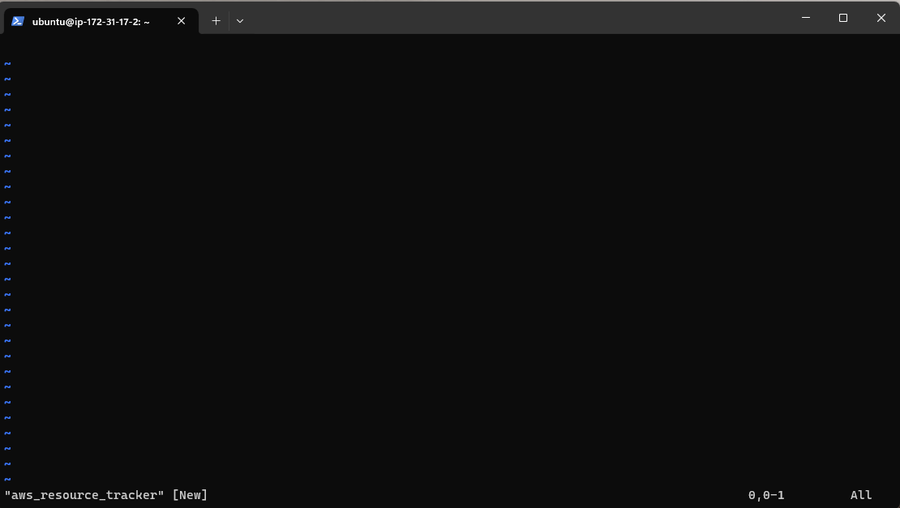
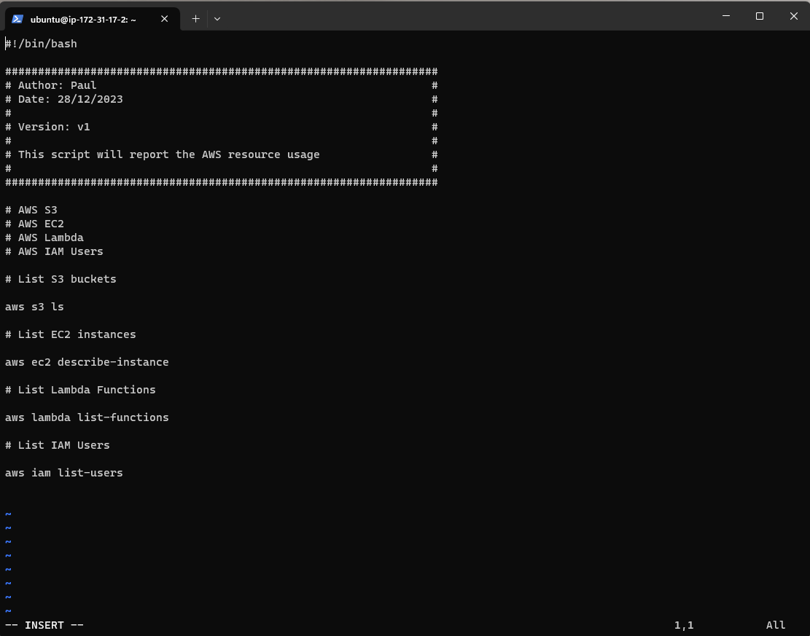

# DevOps-Project-2

# Create a Monitoring APP using Shell scripts

### Create an APP using Shell scripts to monitor the EC2, S3, Lambda and IAM Users of an account.

### Use case: Check how many EC2, S3, Lambda and IAM Users are in the account.

## Step 1:

### 1.1: Launch an EC2 instance running Ubuntu.

### 1.2: Connect to the EC2 instance from your local machine, and make sure that you have the AWS CLI installed.

### 1.3: Configure the credentials to communicate with AWS:

`aws configure`

### !!! Make sure you fill all the details in. If you do not already have credentials file, you can create it from AWS console from the "Security credentials" section from the top right-hand side where your profile is. !!!

## Step 2: Create a script file.

### 2.1: Run:

`vim aws_resource_tracker.sh`

### Expected output:

### 2.2: Edit the file by pressing " i " on keyboard to change to the "insert mode".

### 2.3: Type the first command:

` #!/bin/bash`

### 2.4: Write about the script:

### !!!  You start off by giving some details about who created the script, when, what version( in case you want to do updates) and what the script does. !!!

### !!! Always try to give a description about what the command does. e.g: # List s3 buckets for  "aws s3 ls"  so people who are new using the services will know what the commands do.

### 2.5: Save and quit to see how the script works. 

1. Press " ESC " 
2. Press " Shift+: "
3. Type " wq! "  
4. Press " Enter "

### Step 3: We now check how the script works by doing the following.

### 3.1: Run: 

` chmod 777 aws_resource_tracker.sh`

### This is giving the permissions, not the best practice to use "777" but for the purpose of the demo we are all right.

### 3.2: Run:

` ./aws_resource_tracker.sh `